# Lenny's Podcast Episodes - 3D Relational Graph

An interactive 3D visualization tool for exploring Lenny's Podcast episodes and their relationships based on key takeaways and metadata dimensions.

## Features

- **295 Episodes**: All episodes from Lenny's Podcast archive with AI-extracted insights
- **3D Interactive Graph**: 
  - Force-directed layout showing relationships between episodes
  - Zoom, rotate, and pan controls
  - Click nodes to see episode details
- **Dimension-Based Filtering**:
  - **Category**: Filter by insight categories (product, growth, leadership, etc.)
  - **Functions**: Filter by functional areas (product, engineering, design, etc.)
  - **Primary Audience**: Filter by target audience (founders, PMs, engineers, etc.)
- **Episode Details**: 
  - View key takeaways
  - See categories, functions, and primary audience
  - Direct link to raw transcript

## Quick Start

### View the Graph

1. Start a local web server:
   ```bash
   python3 -m http.server 8000
   ```

2. Open in browser:
   - **V2 (Recommended)**: `http://localhost:8000/graph_visualization_v2.html`
   - **V1 (Legacy)**: `http://localhost:8000/graph_visualization.html`

### Interact with the Graph

- **Rotate**: Click and drag to rotate the view
- **Zoom**: Scroll wheel or pinch to zoom in/out
- **Pan**: Right-click and drag (if OrbitControls is available)
- **Select Node**: Click on any node to see:
  - Episode name and guest
  - Categories, Functions, and Primary Audience
  - Key takeaways
  - Link to raw transcript
- **Filter**: Use the dimension dropdowns to filter episodes
- **Collapse Filters**: Click the "−" button to collapse the filter panel

## Workflow

The data processing pipeline follows these steps:

```mermaid
flowchart LR
    A[Raw Transcripts<br/>.txt files] --> B[Convert to Batch Format<br/>prepare_together_batch.py]
    B --> C[Batch Inference<br/>Together.ai API<br/>meta-llama/Meta-Llama-3.1-70B-Instruct-Turbo]
    C --> D[Extract Insights<br/>Key Takeaways & Metadata]
    D --> E[Clean & Structure<br/>Final_lenny_extracted_cleaned.jsonl]
    E --> F[3D Graph Visualization<br/>graph_visualization_v2.html]
    
    style A fill:#4a9eff,stroke:#333,stroke-width:2px,color:#fff
    style B fill:#6c757d,stroke:#333,stroke-width:2px,color:#fff
    style C fill:#28a745,stroke:#333,stroke-width:2px,color:#fff
    style D fill:#ffc107,stroke:#333,stroke-width:2px,color:#000
    style E fill:#17a2b8,stroke:#333,stroke-width:2px,color:#fff
    style F fill:#dc3545,stroke:#333,stroke-width:2px,color:#fff
```



### Step-by-Step Process

1. **Convert Data to Batch Format**
   - Script: `scripts/prepare_together_batch.py`
   - Input: Transcript `.txt` files
   - Output: `together_batch_input.jsonl` (Together.ai batch-compatible format)
   - Format: Each line contains a JSON object with `custom_id`, `body.model`, and `body.messages`

2. **Submit Batch Inference**
   - Platform: [Together.ai Batch API](https://docs.together.ai/docs/batch-inference)
   - Model: `meta-llama/Meta-Llama-3.1-70B-Instruct-Turbo` (50% discount for batch processing)
   - Process: Upload batch file → Create batch job → Wait for completion (typically 24-72 hours)
   - Output: Extracted insights including:
     - Key takeaways with categories
     - Metadata tags (topics, functions, company_stage, seniority_level, primary_audience)

3. **Visualize in HTML Graph**
   - File: `graph_visualization_v2.html`
   - Technology: Three.js for 3D rendering
   - Features:
     - Interactive 3D force-directed graph
     - Nodes represent episodes, edges represent shared dimensions
     - Dimension-based filtering (Category, Functions, Primary Audience)
     - Click nodes to view details and access transcripts

For detailed instructions on each step, see:
- **Batch Processing**: `docs/BATCH_INFERENCE_GUIDE.md`
- **Extraction**: `docs/EXTRACTION_INSTRUCTIONS.md`
- **Deployment**: `docs/DEPLOYMENT.md`

## Repository Structure

```
.
├── graph_visualization_v2.html    # Main visualization (V2)
├── graph_visualization.html        # Legacy visualization (V1)
├── index.html                      # Landing page
├── Final_lenny_extracted_cleaned.jsonl  # Main data file (295 episodes)
├── README.md                       # This file
├── vercel.json                     # Vercel deployment config
├── netlify.toml                    # Netlify deployment config
├── deploy.sh                       # Deployment script
│
├── transcripts/                    # Raw transcript files (301 .txt files)
│   ├── Melissa Perri + Denise Tilles.txt
│   └── ...
│
├── scripts/                        # Python extraction scripts
│   ├── prepare_together_batch.py  # Convert transcripts to batch format
│   ├── convert_to_json.py         # Convert .txt files to JSONL
│   ├── extract_metadata_ai.py     # AI-powered extraction (Together.ai)
│   ├── test_ai_extraction.py      # Test script for AI extraction
│   ├── prepare_finetuning_data.py # Prepare fine-tuning datasets
│   └── requirements.txt           # Python dependencies
│
├── data/                           # Data files and intermediate outputs
│   ├── episodes_metadata.json     # Legacy metadata (298 episodes)
│   ├── batch_inference.jsonl       # Batch inference outputs
│   ├── train_data.jsonl            # Training data
│   └── ...
│
└── docs/                           # Documentation
    ├── DEPLOYMENT.md               # Deployment guide
    ├── AI_DEPLOYMENT_README.md     # AI tool deployment guide
    ├── EXTRACTION_INSTRUCTIONS.md  # Extraction guide
    ├── FINETUNING_README.md        # Fine-tuning guide
    └── ...
```

## Data Structure

### V2 Data Format (Final_lenny_extracted_cleaned.jsonl)

Each line is a JSON object with:
- `host_name`: Episode guest/host name
- `key_takeaways`: Array of insight objects with:
  - `insight`: The key takeaway text
  - `category`: Category (product, growth, leadership, etc.)
  - `evidence`: Supporting quote
- `metadata_tags`: Object with:
  - `topics`: Array of topic tags
  - `functions`: Array of function tags
  - `company_stage`: Array of company stages
  - `seniority_level`: Array of seniority levels
  - `primary_audience`: Array of audience tags
- `functions`: Top-level functions array
- `company_stage`: Top-level company stage array
- `primary_audience`: Top-level primary audience array

## Graph Structure

- **Nodes**: Each episode is represented as a blue sphere
- **Edges**: Episodes are connected if they share at least 2 common dimensions (categories, functions, or audiences)
- **Filtering**: Episodes are filtered using AND logic across selected dimensions

## Technical Details

- Built with Three.js for 3D rendering
- Force-directed layout algorithm for node positioning
- Responsive design that works on desktop and mobile
- No server required - runs entirely in the browser (except for loading data files)

## Extracting New Data

To extract metadata using AI:

1. Set your Together.ai API key:
   ```bash
   export TOGETHER_API_KEY='your-api-key'
   ```

2. Run the extraction:
   ```bash
   python3 scripts/extract_metadata_ai.py
   ```

See `docs/EXTRACTION_INSTRUCTIONS.md` for detailed instructions.

## License

This project contains transcripts and data from Lenny's Podcast. Please respect the original content creators.

## Credits

- Podcast: [Lenny's Podcast](https://www.lennysnewsletter.com/)
- Transcripts: Public archive
- Visualization: Built with Three.js
